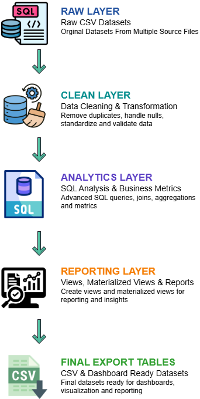

# 📺 OTT Streaming Analytics Platform

## 📌 Project Overview

This project builds a complete OTT Streaming Analytics Platform using PostgreSQL.

The goal of this project is to analyze OTT platform user behavior, streaming engagement, content performance, subscription activity, revenue trends, churn risk, and platform growth metrics using advanced SQL and PostgreSQL analytics engineering techniques.

The project combines raw OTT content data with large-scale generated user activity datasets to simulate a real-world streaming analytics environment.

---

---

# 🎯 Project Objective

- Analyze OTT platform user behavior
- Measure content engagement and watch activity
- Build advanced SQL analytics pipelines
- Perform churn and retention analysis
- Analyze revenue and subscription trends
- Create reporting and analytics layers
- Implement PostgreSQL optimization techniques
- Build export-ready reporting datasets

---

# 🛠️ Technologies Used

## 🐘 Database

- PostgreSQL
- pgAdmin

---

# 📂 Dataset Information

The project uses multiple OTT platform datasets including:

- OTT content metadata
- User information
- Device information
- Subscription records
- Payment transactions
- Session activity
- Watch history
- User event logs

---

# 📁 Raw Tables

The project contains:

- netflix_titles
- users
- devices
- subscriptions
- payments
- sessions
- watch_history
- user_events

---

# 🏗️ Database Architecture

The project follows a multi-layer PostgreSQL architecture:

---

# 🧹 Data Cleaning & Transformation

The project includes:

- Duplicate checking
- Null value analysis
- Invalid value filtering
- Relationship validation
- Data standardization
- Content metadata transformation
- JSONB metadata creation
- Genre normalization
- Clean table creation
- Primary key and foreign key implementation

---

# 🧠 PostgreSQL Concepts Covered

The project implements multiple advanced PostgreSQL analytics and database engineering concepts including:

- CTE (Common Table Expressions)
- Multiple CTE Analytics Pipelines
- Window Functions
- ROW_NUMBER
- RANK
- DENSE_RANK
- LAG
- LEAD
- Running Total Analysis
- Moving Average Analysis
- Cohort Analysis
- Retention Analysis
- JSONB Metadata
- ARRAY Functions
- UNNEST Operations
- DATE_TRUNC
- INTERVAL Operations
- CREATE VIEW
- CREATE MATERIALIZED VIEW
- REFRESH MATERIALIZED VIEW
- Functions
- Stored Procedures
- EXPLAIN ANALYZE
- Query Optimization
- Single Column Indexing
- Composite Indexing
- Partial Indexing
- GIN Index for JSONB
- Churn Risk Analysis
- User Engagement Analytics
- Revenue Analytics
- Content Performance Analytics
- Export-Ready Reporting Layer
---

# 🔄 Project Workflow

**Raw Data → Data Cleaning → Data Validation → Clean Layer → Advanced SQL Analytics → JSONB Analysis → Churn Analysis → Reporting Views → Materialized Views → Query Optimization → Final Reporting Tables → CSV Export**

---

# 📊 SQL Analytics Performed

The project includes advanced SQL analysis on:

1. TOP 10 Most Engaged Users  
2. Most Rewatched Content  
3. Average Gap Between User Sessions  
4. Completion Rate by Genre  
5. Monthly Active Users  
6. User Retention Signal  
7. Device-wise Watch Behavior  
8. Revenue Contribution by User Segment  
9. Rating-wise User Engagement  
10. Release Year-wise Watch Trend  
11. Top Titles by Engagement  
12. Country Wise Content Demand  
13. Age Group vs Content Rating  
14. Old vs New Content Engagement  
15. Title Drop-off Analysis  
16. Movie vs TV Show Count  
17. TV Show Season Analysis  
18. Latest Added Titles  
19. Oldest Released Titles  
20. Content Added by Month  
21. TOP Genre  
22. Genre-wise Watch Time  
23. User Favourite Genre  
24. Top 3 Genres Per User (DENSE_RANK)  
25. Running Monthly Watch Time  
26. 7-Days Moving Average Watch Trend  
27. 30-Days Moving Average Watch Trend  
28. User Watch Streak Analysis  
29. Revenue Growth Month-over-Month  
30. User Lifetime Value (LTV)  
31. Multiple Watches Detection  
32. Most Loyal Users by Active Months  
33. Genre Retention Analysis  
34. Cohort Analysis  

---

# ⚙️ Database Engineering

## 🧩 Genre Bridge Table

A normalized genre bridge table was created using ARRAY and UNNEST functions to support genre-level analytics and many-to-many content relationships.

---

## 📦 JSONB Metadata

JSONB metadata objects were created for:

- Genres
- Cast Information
- Country
- Rating

The project also includes JSONB search and filtering operations.

---

## 📈 Materialized View

A materialized reporting layer was created for monthly platform metrics to improve heavy aggregation query performance.

---

# ⚡ Query Optimization

The project includes:

- EXPLAIN ANALYZE
- Sequential Scan Analysis
- Index Optimization
- Composite Indexing
- Partial Indexing
- JSONB GIN Indexing

Performance comparisons were analyzed before and after indexing.

---

# 🏢 Reporting Layer

The reporting schema contains:

## 📌 Views

- vw_user_engagement
- vw_content_performance
- vw_revenue_summary

---

## 📌 Materialized View

- mv_monthly_platform_metrics

---

## 📌 Final Reporting Tables

- final_user_analytics
- final_content_analytics
- final_revenue_analytics
- complete_watch_analytics_report

---

# 📊 Final Reporting Dataset

The final reporting dataset includes:

- User information
- Content information
- Device information
- Session information
- Watch behavior metrics
- Churn risk indicators
- Engagement metrics
- Completion analysis
- Watch duration segmentation

---

# 📤 Final Export

The project exports final analytics-ready CSV datasets for:

- Power BI
- Tableau
- Excel
- Dashboard Development
- Reporting

---

# 🔥 Key Business Insights

- User engagement varied significantly across different content genres.
- Certain genres generated much higher completion rates and watch time.
- Rewatch behavior highlighted highly engaging OTT content.
- Long watch sessions strongly correlated with higher user retention.
- Revenue contribution differed across user segments and subscription activity.
- Device type influenced watch duration and completion behavior.
- High-risk churn users showed significantly lower recent platform activity.
- Newer content generated stronger user engagement compared to older titles.
- Monthly active user trends revealed platform growth patterns over time.
- Query optimization and indexing improved analytical query performance.

---

# 🎯 Final Output

The platform generates:

- User engagement analytics
- Content performance analytics
- Revenue analytics
- Churn intelligence
- Monthly platform metrics
- Export-ready reporting datasets

---

# 👨‍💻 About Me

## Sayan Naha

📧 **Email:** snsayan2012@gmail.com  
🔗 **LinkedIn:** [Sayan Naha](https://www.linkedin.com/in/sayan-naha/)
